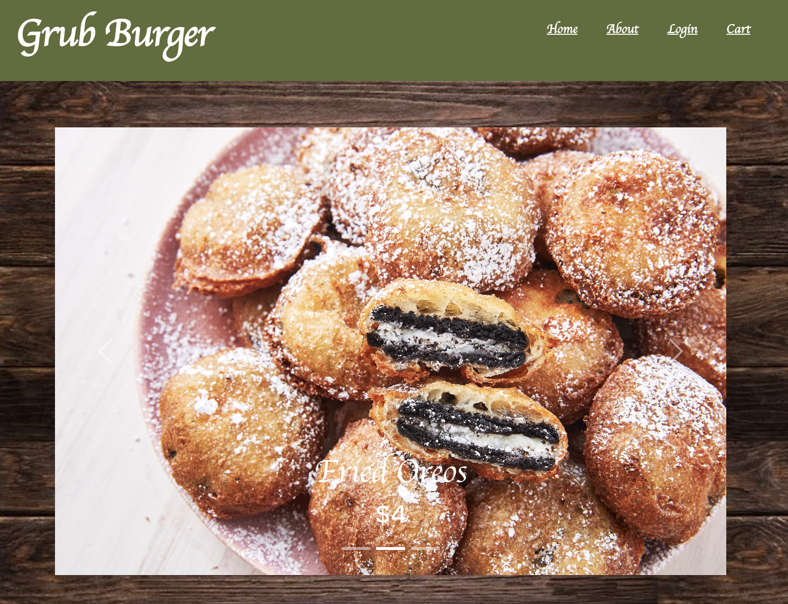

# Grub Burger

  
## A restaurant app that allows you to create a profile, submit an order, and get your grub on! You can also get rewards points for each order that you put in.
-----
## Table of Contents
- [Installation](#installation)
- [Usage](#usage)
- [License](#license)
- [Contributors](#contributors)
- [Challenges]()
- [Screenshot](#screenshot)
- [Questions](#questions)

## Installation
-----
You can visit the deployed heroku app [here](https://).

## Usage
------
You can create a profile and submit orders to the Grub Burger restaurant through the link above.

## License
-------

ISC

## Contributors
------
Jacqueline Merlan
James Harrington
Amy Rodriguez
Emanuel Silva-Lopez
James Stanley

## Screenshot
-----

## Questions
-----
You can find the project on [Github](https://github.com/eucalyptus1/grub-burger)

